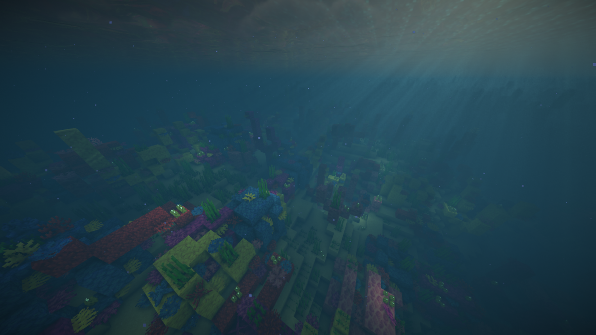
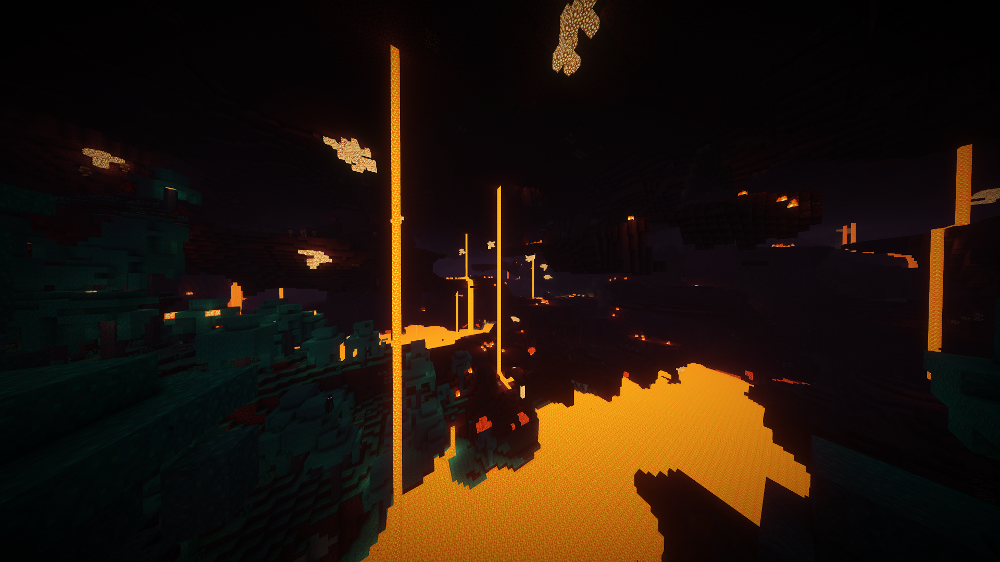

# Beyond Vanilla
## A Minecraft shader pack
To install dowload this repo as a zip and add to your shaderpacks folder in your .minecraft directory

# Compatibilty
<li>Tested on iris and soduim 1.1.6</li>

<li>Works best on mid to low tier devices</li>

<li>Not tested on optifine</li>

<li>Works on Nvidia gpus  (Tested on a 4070 Ti)</li>

<li>Not tested on amd or mac</li>

# TODO
        - [ ] Add more screenshots
        - [ ] Improve performance
        - [ ] Add more features
        - [ ] Improve sky in the end
        - [ ] Improve portals
        - [ ] Improve GUI 
        - [ ] Improve Sun and moon
        - [ ] Upload to modwrinth

# Credits
Hotsuop \ Made the base shader

If you want your name here contribute something to the repo!

## Screenshots
## Coral in a warm ocean

## Nether
